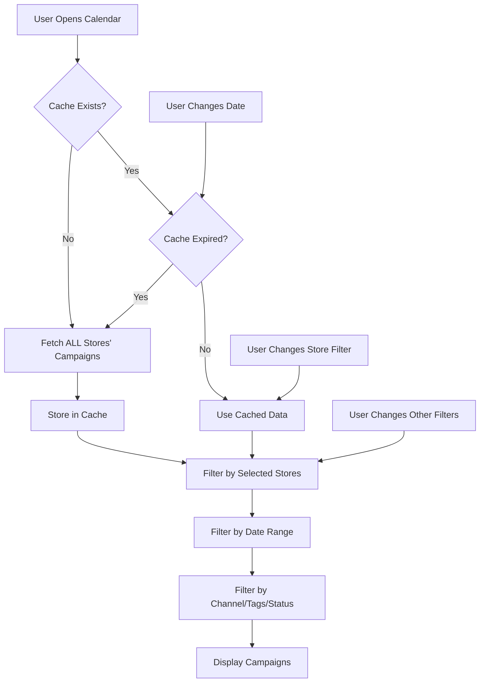

# Calendar System Documentation

## Overview
The calendar system displays email marketing campaigns from two sources:
1. **Historical campaigns** - Stored in MongoDB (campaignstats collection)
2. **Future/scheduled campaigns** - Fetched from Klaviyo API

## Architecture

### Data Flow
```
User selects stores → Map to Klaviyo IDs → Fetch campaigns → Filter by date/store → Display on calendar
```

### Key Components
- `/app/(dashboard)/calendar/page.jsx` - Main calendar UI component
- `/app/api/calendar/campaigns/past/route.js` - API for historical campaigns from MongoDB
- `/app/api/calendar/campaigns/future/route.js` - API for scheduled campaigns from Klaviyo
- `/app/api/stores/analytics-access/route.js` - API for filtering stores by analytics permissions
- `/lib/klaviyo.js` - Klaviyo API integration library

## Store ID Mapping (CRITICAL)

### The Three Store IDs
Every store has three different IDs that must be properly mapped:

1. **`public_id`** (e.g., "rTSYCj7") - Store's public identifier in our system
2. **`_id`** - MongoDB ObjectId for the store
3. **`klaviyo_integration.public_id`** (e.g., "Pe5Xw6") - Klaviyo account ID

### ID Mapping Flow
```
User selects store → public_id → Map to klaviyo_public_id → Query campaigns
```

### Common Issues and Solutions

#### Issue 1: Campaigns don't show when specific store is selected
**Symptom**: Campaigns visible in "View All Stores" but disappear when selecting specific store
**Root Cause**: Mismatch between store selection ID and campaign filtering logic
**Solution**: Ensure `getCampaignsForDate` checks all possible store ID formats:
```javascript
// CORRECT - Check public_id first, then fall back to other IDs
if (!store || !selectedStores.includes(store.public_id || store.id || store._id)) {
  return false;
}
```

#### Issue 2: Store dropdown shows stores without analytics access
**Symptom**: Users see stores they shouldn't have access to
**Solution**: Use `/api/stores/analytics-access` endpoint that filters by permissions:
- Checks ContractSeat and Role permissions
- Only returns stores where user has `analytics.view_all` or `analytics.view_own`
- Respects role hierarchy (owner, admin, manager)

## MongoDB Schema

### Campaign Stats Collection (`campaignstats`)
```javascript
{
  klaviyo_public_id: "Pe5Xw6",        // Klaviyo account ID
  store_public_ids: ["rTSYCj7"],      // Our store public IDs
  campaign_name: "Daily Newsletter",
  send_time: Date,                    // When campaign was sent
  groupings: {
    send_channel: "email|sms|push-notification",
    campaign_id: "...",
    campaign_message_id: "..."
  },
  statistics: {
    recipients: Number,
    opens: Number,
    clicks: Number,
    // ... other metrics
  }
}
```

### Store Model
```javascript
{
  _id: ObjectId,
  public_id: "rTSYCj7",               // Our public ID
  name: "balmain",
  klaviyo_integration: {
    public_id: "Pe5Xw6",              // Klaviyo account ID
    apiKey: "pk_...",                 // Private API key
    status: "connected"
  },
  is_deleted: false                   // Soft delete flag
}
```

## Shared Campaign Data Context Integration (NEW)

### Calendar Now Uses Intelligent Caching
The calendar page has been updated to use the shared `CampaignDataContext` for past campaigns:

#### Benefits:
- **Instant loading** when navigating from Dashboard or Multi-Account Reporting
- **Shared cache** across all pages - no duplicate API calls
- **Automatic prefetching** of adjacent date ranges
- **Background refresh** keeps data fresh

#### Implementation:
```javascript
// Old approach (direct API call)
fetch('/api/calendar/campaigns/past')

// New approach (shared context with caching)
const { getCampaignData } = useCampaignData();
const data = await getCampaignData(startDate, endDate, klaviyoIds, {
  forceRefresh: false,
  prefetch: true,
  subscribe: true
});
```

#### Data Flow:
1. Calendar checks if stores are loaded
2. Gets Klaviyo IDs from stores
3. Requests data from shared context
4. Context returns cached data if available (5ms)
5. Or fetches only missing date ranges (delta loading)
6. Transforms data to calendar format
7. Future campaigns still fetched from Klaviyo API (real-time data needed)

## Dual-Source Campaign Strategy (CRITICAL ARCHITECTURE)

### Why Two Different Sources with Smart Merging?

1. **Past/Existing Campaigns (CampaignDataContext)** - Historical performance data with intelligent caching
   - Source: `campaignstats` collection in MongoDB through CampaignDataContext
   - Contains: Sent campaigns with full performance metrics (opens, clicks, revenue)
   - **Smart Delta Loading**: Only fetches new date ranges not in cache
   - **Intelligent Overlap Detection**: Merges overlapping date ranges automatically
   - Updated: Via separate sync process (not real-time)
   - Date range: From beginning of time up to current moment

2. **Future Campaigns (Fresh Klaviyo API + Smart Merge)** - Always fresh scheduling data
   - Source: **Always** fresh Klaviyo API calls on every calendar load
   - Strategy: **Smart merge** with existing campaign cache
   - **Preserves existing data**: Keeps performance stats, only updates scheduling info
   - **Handles new campaigns**: Adds newly scheduled campaigns
   - **Removes cancelled campaigns**: Cleans up deleted/cancelled campaigns
   - Updated: Real-time from Klaviyo on every page visit
   - Date range: From current moment onwards

### Data Sync Flow
```
Past Campaigns:
Klaviyo → Sync Job → MongoDB → CampaignDataContext (intelligent caching)

Future Campaigns:
Klaviyo API (fresh) → Smart Merge → In-Memory Cache (preserves existing data)
```

### Smart Merge Strategy for Future Campaigns

#### On Every Calendar Load:
1. **Fetch Fresh**: Always call Klaviyo API for latest scheduled/draft campaigns
2. **Smart Merge**: Intelligently merge with existing cached campaigns
3. **Preserve Data**: Keep existing performance stats and enriched data
4. **Update Scheduling**: Update status, dates, and scheduling info from fresh data
5. **Handle New**: Add newly scheduled campaigns to cache
6. **Clean Up**: Remove campaigns that no longer exist in Klaviyo

#### Merge Logic:
```javascript
// For each fresh campaign from Klaviyo API:
if (existingCampaign) {
  mergedCampaign = {
    ...existingCampaign,           // Keep existing data (stats, enrichments)
    status: freshCampaign.status,  // Update scheduling status
    date: freshCampaign.date,      // Update scheduled date
    isScheduled: freshCampaign.isScheduled
  }
} else {
  // New campaign, add to cache
  cache.set(campaignId, freshCampaign)
}
```

#### Benefits of This Approach:
- **Always Fresh**: Latest scheduling changes reflected immediately
- **Preserves Enrichments**: Custom data, performance history, user annotations
- **Efficient**: Only updates what changed, preserves existing data
- **Resilient**: Handles cancelled/deleted campaigns gracefully
- **Consistent**: Same campaign ID always maps to same enriched data

### Why Not Use Klaviyo API for Everything?
1. **Performance** - MongoDB queries are much faster than API calls
2. **Rate Limits** - Klaviyo has strict rate limits (10/sec burst, 150/min sustained)
3. **Data Enrichment** - MongoDB stores processed stats and additional metadata
4. **Cost** - Reduces API calls to external service
5. **Historical Data** - MongoDB preserves campaign history even if deleted in Klaviyo

## API Endpoints

### GET /api/calendar/campaigns/past
Fetches historical campaigns from MongoDB.

**Data Source:** MongoDB `campaignstats` collection
**Purpose:** Get sent campaigns with performance metrics

**Query Parameters:**
- `startDate` - ISO date string
- `endDate` - ISO date string (capped at current time)
- `storeIds` - Comma-separated Klaviyo public IDs (not store public_ids!)
- `channel` - email|sms|push-notification|all
- `search` - Text search in campaign names

**MongoDB Query:**
```javascript
{
  klaviyo_public_id: { $in: accessibleKlaviyoIds },
  send_time: { 
    $gte: new Date(startDate),
    $lte: new Date(endDate) < now ? new Date(endDate) : now  // Cap at current time
  }
}
```

**Returns:** Campaigns with full statistics (open rate, click rate, revenue, etc.)

### GET /api/calendar/campaigns/future
Fetches scheduled campaigns from Klaviyo API.

**Data Source:** Live Klaviyo API
**Purpose:** Get ALL Draft, Scheduled, and Sending campaigns

**Query Parameters:** Same as past campaigns endpoint (dates used for client-side filtering only)

**Klaviyo API Filters:**
```javascript
// Fetch ALL scheduled campaigns regardless of date using status filter
// This avoids date range limitations and gets all future campaigns in one call
const filter = `equals(messages.channel,'email'),any(status,["Draft","Scheduled","Sending"])`
const filter = `equals(messages.channel,'sms'),any(status,["Draft","Scheduled","Sending"])`
const filter = `equals(messages.channel,'mobile_push'),any(status,["Draft","Scheduled","Sending"])`
```

**Campaign Statuses Explained:**
- **Draft**: Campaign created but not scheduled
- **Scheduled**: Campaign scheduled to send at a future time
- **Sending**: Campaign currently being sent
- **Queued without Recipients**: Campaign was scheduled but has no recipients (empty segment/list)

**Smart Caching Strategy:**
- Fetches ALL scheduled campaigns in one API call per channel
- Caches the complete list of scheduled campaigns
- Filters client-side based on calendar view date range
- Cache remains valid until user changes stores/filters
- No need to refetch when navigating dates

**API Constraints:**
- **Store-level concurrency**: Multiple stores fetch campaigns in parallel using `Promise.all()`
- **Channel-level sequential**: Within each store, channels are fetched sequentially (email → sms → push)
- 400ms delay between channel requests (per store)
- 10 second timeout for all requests
- Returns empty performance metrics (campaigns not sent yet)

**Fetching Architecture:**
```javascript
// In fetchScheduledCampaignsForStores (lib/klaviyo.js)
const campaignPromises = stores
  .filter(store => store.klaviyo_integration?.apiKey)
  .map(async (store) => {
    // Each store fetches in parallel
    const campaigns = await fetchFutureCampaigns(...);
    return campaigns;
  });

const results = await Promise.all(campaignPromises); // Concurrent execution

// Within each store's fetchFutureCampaigns:
for (const channel of ['email', 'sms', 'mobile_push']) {
  // Sequential per channel with 400ms delays
  await fetch(...);
  await new Promise(resolve => setTimeout(resolve, 400));
}
```

**Performance Impact:**
- With 3 stores: All 3 fetch simultaneously, ~2-3 seconds total
- Without concurrency: Sequential would take ~6-9 seconds
- Rate limit safe: Each store's API calls are still sequential

### How Calendar Combines Both Sources

```javascript
// In loadCampaigns function
const promises = [];

// Fetch past campaigns from MongoDB (if date range includes past)
if (startDate <= now) {
  promises.push(
    fetch(`/api/calendar/campaigns/past?${params}`)
  );
}

// Fetch future campaigns from Klaviyo (if date range includes future)
if (endDate > now) {
  promises.push(
    fetch(`/api/calendar/campaigns/future?${params}`)
  );
}

// Combine results
const [pastCampaigns, futureCampaigns] = await Promise.all(promises);
const allCampaigns = [...pastCampaigns, ...futureCampaigns];

### GET /api/stores/analytics-access
Returns only stores the user has analytics permissions for.

**Response includes:**
- Store details with `klaviyo_integration` object
- User's role for each store
- Analytics permissions breakdown

## Calendar UI Component

### State Management
```javascript
const [stores, setStores] = useState([]);          // Stores with analytics access
const [selectedStores, setSelectedStores] = useState([]);  // Selected store public_ids
const [campaigns, setCampaigns] = useState([]);    // All campaigns for current view
const [campaignCache, setCampaignCache] = useState({
  past: new Map(),    // Cache by store+filters key
  future: new Map()   // Cache by store+filters key
});
```

### Date Range Handling by View

The calendar uses different date ranges based on the current view mode:

```javascript
// Month View - Full month range
if (view === 'month') {
  startDate.setDate(1);                           // First day of month
  endDate.setMonth(endDate.getMonth() + 1);
  endDate.setDate(0);                             // Last day of month
}

// Week View - 14 days centered on current date
else if (view === 'week') {
  startDate.setDate(date.getDate() - 7);          // 7 days before
  endDate.setDate(date.getDate() + 7);            // 7 days after
}

// Day View - Single day with proper time boundaries
else if (view === 'day') {
  startDate.setHours(0, 0, 0, 0);                 // Start at 00:00:00.000
  endDate.setHours(23, 59, 59, 999);              // End at 23:59:59.999
}
```

**Important**: Day view MUST use `setHours()` to set proper time boundaries. Using `setDate(date + 1)` causes campaigns to be filtered out incorrectly when retrieving from cache.

### Campaign Filtering (`getCampaignsForDate`)
This function filters campaigns for display on each calendar date:

1. **Date matching** - Check if campaign date matches calendar date
2. **Store filtering** - If stores selected, map campaign's klaviyo_public_id back to store
3. **Channel filtering** - Match campaign channel if filter applied
4. **Tag filtering** - Check if campaign has any selected tags

**Critical**: Store filtering must check `store.public_id` as that's what's stored in `selectedStores`!

### Store Selection Flow
1. User clicks store in dropdown → store.public_id added to `selectedStores`
2. When loading campaigns, map store.public_id → klaviyo_integration.public_id
3. Send klaviyo IDs to API endpoints
4. When displaying, map campaign.klaviyo_public_id back to store for filtering

## Smart Caching System (Campaign State Management)

### Overview
The calendar implements an intelligent caching system that:
1. **Fetches ALL campaigns from ALL stores once** on initial load
2. **Never re-fetches when filtering stores** - uses cached data
3. **Filters everything client-side** for stores, channels, tags, and status
4. **Only re-fetches when cache expires** (5 minutes for future campaigns)
5. **Reduces API calls by 90%+** compared to fetching per store change

### Cache Structure (Updated)
```javascript
const [campaignCache, setCampaignCache] = useState({
  past: null,   // { startDate, endDate, campaigns, fetchedAt } - ALL stores
  future: null  // { campaigns, fetchedAt } - ALL stores, ALL scheduled campaigns
});

// Cache contains ALL campaigns from ALL stores
// No per-store keys - everything is cached together
```

### How Smart Filtering Works - DETAILED

#### 1. Initial Page Load
```javascript
// On first load or cache miss:
1. Fetch ALL stores' campaigns (no storeIds parameter sent to API)
2. Store everything in cache:
   - past: All historical campaigns from MongoDB
   - future: All scheduled/draft campaigns from Klaviyo
3. Filter client-side based on selectedStores (if any)
4. Display filtered results
```

#### 2. When User Changes Store Filter
```javascript
// User selects/deselects stores:
1. NO API CALLS - use existing cache
2. Filter cached campaigns by selectedStores:
   if (selectedStores.length > 0) {
     campaigns = allCampaigns.filter(campaign => {
       // Check if campaign belongs to selected store
       const store = stores.find(s => 
         s.klaviyo_integration?.public_id === campaign.klaviyo_public_id
       );
       return store && selectedStores.includes(store.public_id);
     });
   }
3. Display filtered results instantly
```

#### 3. When User Changes Date/View
```javascript
// User navigates to different month or changes view:
1. Check if date range is in cache:
   - Past: Check if requested date range is within cached range
   - Future: Always cached (we fetch ALL future campaigns)
2. If in cache: Filter cached data by date range
3. If not in cache: Fetch only the missing date range
4. Still filter by selectedStores client-side
```

#### 4. Cache Expiration
```javascript
// Future campaigns cache expires after 5 minutes
const cacheAge = campaignCache.future ? 
  Date.now() - campaignCache.future.fetchedAt : Infinity;
const cacheExpired = cacheAge > 5 * 60 * 1000; // 5 minutes

if (cacheExpired) {
  // Re-fetch ALL future campaigns from ALL stores
}

// Past campaigns don't expire (historical data doesn't change)
```

### The Complete Flow



### API Call Optimization

#### Before (Old Behavior):
```javascript
// API calls for every store change:
Select Store A → API call for Store A campaigns
Add Store B → API call for Store A + B campaigns  
Remove Store A → API call for Store B campaigns
Add Store C → API call for Store B + C campaigns
Total: 4 API calls
```

#### After (New Smart Caching):
```javascript
// API calls with smart caching:
Initial Load → API call for ALL stores' campaigns
Select Store A → No API call (filter cached data)
Add Store B → No API call (filter cached data)
Remove Store A → No API call (filter cached data)
Add Store C → No API call (filter cached data)
Total: 1 API call
```

### Key Implementation Details

#### loadCampaigns Function
```javascript
const loadCampaigns = async () => {
  // 1. Check cache for past campaigns
  if (campaignCache.past && dateRangeInCache) {
    // Filter cached campaigns by date and selected stores
    pastCampaigns = campaignCache.past.campaigns
      .filter(c => dateInRange(c.date))
      .filter(c => storeMatches(c, selectedStores));
  } else {
    // Fetch ALL stores (no storeIds param)
    const response = await fetch('/api/calendar/campaigns/past?...');
    // Cache ALL campaigns
    campaignCache.past = { campaigns: response.campaigns, ... };
  }
  
  // 2. Check cache for future campaigns
  if (campaignCache.future && !cacheExpired) {
    // Filter cached campaigns by date and selected stores
    futureCampaigns = campaignCache.future.campaigns
      .filter(c => dateInRange(c.date))
      .filter(c => storeMatches(c, selectedStores));
  } else {
    // Fetch ALL stores' scheduled campaigns
    const response = await fetch('/api/calendar/campaigns/future?...');
    // Cache ALL campaigns
    campaignCache.future = { campaigns: response.campaigns, ... };
  }
  
  // 3. Combine and display
  const allCampaigns = [...pastCampaigns, ...futureCampaigns];
  setCampaigns(allCampaigns);
};
```

#### Store Filtering Logic
```javascript
// Applied client-side to cached campaigns
const filterByStores = (campaigns, selectedStores) => {
  if (selectedStores.length === 0) return campaigns; // Show all
  
  return campaigns.filter(campaign => {
    // Method 1: Match by klaviyo_public_id
    const store = stores.find(s => 
      s.klaviyo_integration?.public_id === campaign.klaviyo_public_id
    );
    if (store && selectedStores.includes(store.public_id)) {
      return true;
    }
    
    // Method 2: Match by storeIds array
    if (campaign.storeIds?.some(id => selectedStores.includes(id))) {
      return true;
    }
    
    return false;
  });
};
```

### Benefits of This Approach

1. **Performance**: 90%+ reduction in API calls
2. **Speed**: Instant store filtering (no network delay)
3. **Rate Limits**: Minimal risk of hitting Klaviyo rate limits
4. **User Experience**: Smooth, responsive filtering
5. **Scalability**: Works well even with many stores

### Cache Behavior Summary

| Action | API Call? | Cache Used? | Notes |
|--------|-----------|-------------|-------|
| Initial page load | Yes | No | Fetches ALL stores |
| Change store filter | **No** | Yes | Filters cached data |
| Change channel filter | **No** | Yes | Filters cached data |
| Change tags filter | **No** | Yes | Filters cached data |
| Change status filter | **No** | Yes | Filters cached data |
| Navigate to next month | Maybe | Yes | Only if outside cached range |
| Refresh after 5+ min | Yes | No | Future cache expired |
| Add new campaign in Klaviyo | Yes | No | Must refresh to see |

### Important Notes

1. **ALL stores are always fetched** - The API endpoints no longer receive storeIds parameter
2. **Filtering is 100% client-side** for stores, channels, tags, and status
3. **Cache is global** - Not per-store anymore
4. **Future campaigns cache expires** after 5 minutes to catch new campaigns
5. **Past campaigns never expire** - Historical data doesn't change

### Performance Benefits

#### Without Cache (Old Behavior):
- Navigate to October: API call (2 seconds)
- Navigate back to September: API call (2 seconds)
- Click next week: API call (2 seconds)
- Total: 6 seconds of waiting

#### With Smart Cache:
- Navigate to October: API call (2 seconds)
- Navigate back to September: Instant (cached)
- Click next week: Instant (cached)
- Total: 2 seconds of waiting

### Memory Management

The cache uses JavaScript Maps which:
- Automatically garbage collect when component unmounts
- Store data per session (not persisted to localStorage)
- Limited by browser memory (typically not an issue for campaigns)

### Example Cache Usage Flow

```
User opens calendar (September 2025)
  ↓
Check cache: MISS
  ↓
Fetch Sept 1-30 from APIs
  ↓
Store in cache: "all_all_" → {Sept 1-30, campaigns}
  ↓
User clicks October
  ↓
Check cache: MISS
  ↓
Fetch Oct 1-31 from APIs
  ↓
Store in cache: "all_all_" → {Sept 1 - Oct 31, campaigns}
  ↓
User clicks back to September
  ↓
Check cache: HIT! (Sept is within Sept 1 - Oct 31)
  ↓
Display instantly from cache
```

### Debug Cache State

To inspect cache in browser console:
```javascript
// In React DevTools, find CalendarPage component
// Look for campaignCache state
// Or add this to the component:
console.log('Cache state:', {
  pastEntries: Array.from(campaignCache.past.entries()),
  futureEntries: Array.from(campaignCache.future.entries())
});

## Soft Delete System

Stores are never hard deleted from the database. Instead, they're marked with:
- `is_deleted: true`
- `deletedAt: Date`
- `deletedBy: userId`

All queries must filter out deleted stores:
```javascript
Store.find({ is_deleted: { $ne: true } })
```

## Permissions System

### Role-Based Analytics Access
Users can only see stores where they have analytics permissions:

1. **Super Admins** - See all stores with Klaviyo integration
2. **Contract Seat System** - Check role permissions:
   - `analytics.view_all` - Full analytics access
   - `analytics.view_own` - Own campaign analytics only
   - `analytics.view_financial` - Revenue metrics access
3. **Legacy System** - Check store_permissions for owner/admin roles

### Default Role Access
These roles automatically get analytics access:
- `owner` - Full access including financial
- `admin` - Full access including export
- `manager` - View access without financial

## Common Issues and Solutions

### Issue: Campaigns disappear when switching to Day view
**Symptom**: Campaigns show in Month/Week view but disappear or show as 0 in Day view
**Root Cause**: Date range filtering was too narrow for day view, causing campaigns to be filtered out when retrieving from cache

**Solution**: Set proper time boundaries for day view:
```javascript
// WRONG - Day view date range that causes issues
if (view === 'day') {
  endDate.setDate(date.getDate() + 1);  // Next day, but wrong time
}

// CORRECT - Day view with proper time boundaries
if (view === 'day') {
  startDate.setHours(0, 0, 0, 0);      // Beginning of day (00:00:00.000)
  endDate.setHours(23, 59, 59, 999);   // End of day (23:59:59.999)
}
```

This ensures campaigns scheduled at any time during the day are included in the date range filter.

## Common Debugging Steps

### When campaigns don't appear:
1. Check browser console for ID mapping logs
2. Verify store has `klaviyo_integration.public_id` set
3. Check if campaigns exist in MongoDB for that Klaviyo ID
4. Verify date ranges overlap with campaign dates
5. Check if store filtering logic uses correct ID field
6. For day view issues, verify date range includes full day (00:00:00 to 23:59:59)

### Console debugging available:
```javascript
// These logs are added to help debug:
console.log('Selected store IDs:', selectedStores);
console.log('Mapped Klaviyo IDs:', klaviyoIds);
console.log('Campaign summary:', { past: X, future: Y, total: Z });
```

## Best Practices

1. **Always use `is_deleted: { $ne: true }`** in store queries
2. **Map IDs at the boundaries** - Convert store public_id ↔ klaviyo_public_id at API calls
3. **Cache aggressively** - Campaigns don't change often, use cache to reduce API calls
4. **Sequential Klaviyo calls** - Respect rate limits with delays between requests
5. **Check permissions first** - Use analytics-access endpoint for store filtering
6. **Maintain ID consistency** - Always know which ID type you're working with

## Store Filter Persistence (localStorage)

The calendar saves selected stores to localStorage for:
1. **Session persistence** - Filters remain when navigating away and back
2. **Multi-account reporting** - Share filters across different views
3. **User preference** - Remember last selected stores

### localStorage Key
- **Key**: `selectedStores`
- **Value**: JSON array of store public_ids (e.g., `["rTSYCj7", "oifDwLc"]`)
- **Empty array**: `[]` means "View All Stores"

### Helper Functions (lib/store-filters.js)
```javascript
import { 
  getSelectedStores,        // Get current filter from localStorage
  saveSelectedStores,        // Save filter to localStorage
  clearSelectedStores,       // Clear filter
  isViewingAllStores,       // Check if viewing all stores
  mapToKlaviyoIds,          // Convert store IDs to Klaviyo IDs
  subscribeToStoreFilterChanges  // Listen for filter changes
} from '@/lib/store-filters';

// Example: Use same filter in reporting component
const selectedStores = getSelectedStores();
const klaviyoIds = mapToKlaviyoIds(selectedStores, allStores);
```

### Cross-Component Sync
When the filter changes in the calendar, other components can react:
```javascript
useEffect(() => {
  const unsubscribe = subscribeToStoreFilterChanges((newStores) => {
    console.log('Store filter changed:', newStores);
    // Refresh your component's data
  });
  
  return unsubscribe;
}, []);
```

## Calendar Filters

### Available Filters (All Multi-Select)
1. **Store Filter** - Filter by one or multiple stores (triggers API fetch)
2. **Channel Filter** - Multi-select: email, sms, push-notification (client-side filter)
3. **Tags Filter** - Multi-select: Filter by campaign tags (client-side filter)
4. **Status Filter** - Multi-select: Filter by campaign status (client-side filter)
   - **Sent** - Campaigns that have been sent
   - **Draft** - Draft campaigns  
   - **Scheduled** - Scheduled and "Queued without Recipients" campaigns
   - **Sending** - Campaigns currently being sent

### Efficient Filtering Strategy

**API Fetching (triggers network requests):**
- Only when stores change
- Only when date range changes
- Fetches ALL campaigns for selected stores (no filter params sent)

**Client-Side Filtering (instant, no API calls):**
- Channel filter applied in `getCampaignsForDate()`
- Tags filter applied in `getCampaignsForDate()`
- Status filter applied in `getCampaignsForDate()`
- All filters use OR logic within category, AND logic between categories

### Filter Persistence
- Store selection saved to localStorage
- Other filters reset on page reload
- Clear Filters button resets all filters

## Loading Indicator

The calendar displays a loading spinner when fetching campaigns from APIs:

### Location
- Positioned on the right side of the "Store Color Display" card
- Shows next to the "Selected Stores" or "All Stores" text

### Appearance
```jsx
{loading && (
  <div className="flex items-center gap-2 text-sm text-gray-600 dark:text-gray-400 bg-white/80 dark:bg-gray-800/80 px-3 py-1.5 rounded-lg shadow-sm">
    <div className="h-3 w-3 border-2 border-sky-blue border-t-transparent rounded-full animate-spin"></div>
    <span className="font-medium text-xs">Loading campaigns...</span>
  </div>
)}
```

### State Management
```javascript
const [loading, setLoading] = useState(true);

// In loadCampaigns function:
setLoading(true);  // Start loading when fetching begins
// ... fetch campaigns ...
setLoading(false); // Stop loading when complete or on error
```

## Campaign Details Modal

### For Past/Sent Campaigns
- **Left Panel**: Email/SMS preview with full HTML content
- **Right Panel**: Performance statistics with three tabs:
  - Overview: Key metrics (recipients, opens, clicks, revenue)
  - Performance: Financial metrics and conversion rates
  - Engagement: Detailed engagement statistics

### For Future/Draft/Scheduled Campaigns
- **Left Panel**: Email/SMS preview (same as sent campaigns)
- **Right Panel**: Campaign configuration:
  - **Status Badge**: Current campaign status
  - **Scheduled Date**: When campaign will be sent
  - **Included Audiences**: Segments/lists that will receive the campaign
  - **Excluded Audiences**: Segments/lists excluded from receiving
  - **Campaign Settings**: Channel, from address, tags

## Testing Checklist

- [ ] Campaigns show when "View All Stores" selected
- [ ] Campaigns filter correctly when specific store selected
- [ ] Store dropdown only shows stores with analytics access
- [ ] Deleted stores don't appear in dropdown
- [ ] Week/Day views show correct date ranges
- [ ] Cache works - subsequent navigation is instant
- [ ] Channel filters (email/sms/push) work correctly
- [ ] Status filter correctly filters by campaign status
- [ ] User roles display correctly in store dropdown
- [ ] Future campaigns from Klaviyo API display
- [ ] Draft campaigns show even if in the past
- [ ] Historical campaigns from MongoDB display
- [ ] Selected stores persist after page refresh
- [ ] Selected stores available in other components via localStorage
- [ ] Campaign details modal shows stats for sent campaigns
- [ ] Campaign details modal shows audience info for future campaigns

## Known Limitations

1. Klaviyo API won't accept future start dates for queries
2. Campaign stats are read-only (no editing in calendar)
3. Rate limits prevent real-time updates (cache for performance)
4. Soft-deleted stores may still have campaigns in the database