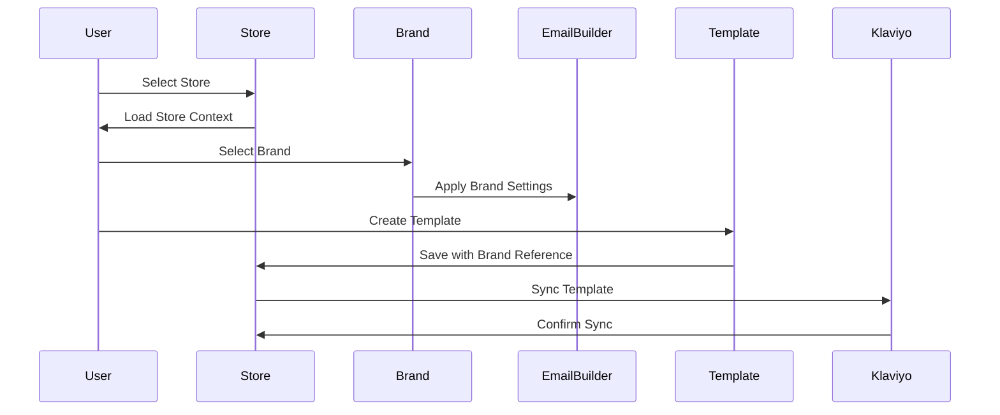
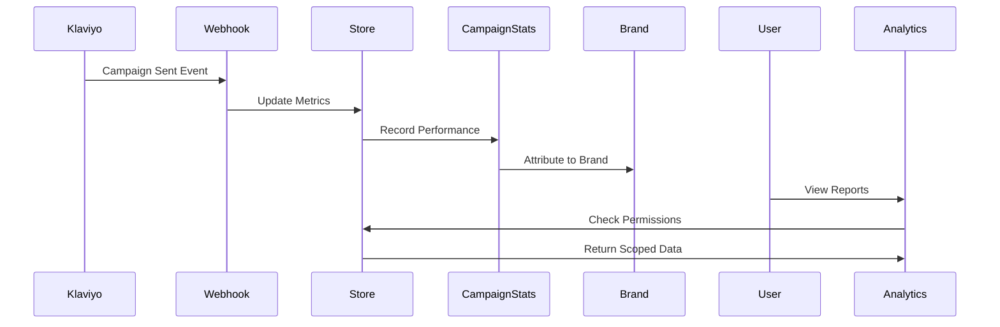

# Product Requirements Document: Data Architecture
## User → Store → Klaviyo → Brand Settings Relationship

### Executive Summary

This document outlines the multi-tenant data architecture that enables users to manage multiple stores, each with their own Klaviyo integrations and multiple brand configurations. The system supports complex organizational structures including agencies managing multiple clients and franchises with multiple locations.

---

## 1. Core Entity Relationships

### 1.1 High-Level Architecture

```
┌──────────┐     M:N      ┌─────────┐     1:N      ┌──────────────┐
│   User   │◄────────────►│  Store  │─────────────►│Brand Settings│
└──────────┘              └─────────┘              └──────────────┘
                               │
                               │ 1:1
                               ▼
                        ┌─────────────┐
                        │   Klaviyo   │
                        │ Integration │
                        └─────────────┘
```

### 1.2 Relationship Cardinality

- **User ↔ Store**: Many-to-Many (M:N)
  - One user can access multiple stores
  - One store can have multiple users with different roles

- **Store → Brand Settings**: One-to-Many (1:N)
  - One store can have multiple brands
  - Each brand belongs to exactly one store

- **Store → Klaviyo**: One-to-One (1:1)
  - Each store has one Klaviyo integration
  - Klaviyo account is tied to the store, not individual brands

---

## 2. Entity Definitions

### 2.1 User Entity

**Purpose**: Represents an individual who can access the platform

**Key Attributes**:
```javascript
{
  _id: ObjectId,
  name: String,
  email: String (unique),
  password: String (hashed),
  stores: [{
    store_id: ObjectId,
    store_public_id: String,
    role: String, // 'owner', 'admin', 'creator', 'member'
    permissions: [String],
    customPermissions: [String],
    restrictions: [String],
    dataScope: String, // 'global', 'organization', 'own_account'
    assignedAccounts: [ObjectId], // For agencies/franchises
    addedAt: Date,
    addedBy: ObjectId
  }],
  integrations: [{
    type: String, // 'shopify', 'klaviyo'
    accessToken: String,
    refreshToken: String,
    metadata: Object
  }],
  createdAt: Date
}
```

**Key Behaviors**:
- Can be a member of multiple stores
- Has different roles/permissions per store
- Can switch between stores in the UI
- Maintains personal integrations (OAuth tokens)

### 2.2 Store Entity

**Purpose**: Represents a business entity (company, client, franchise location)

**Key Attributes**:
```javascript
{
  _id: ObjectId,
  public_id: String (unique, 7 chars), // URL-safe identifier
  name: String,
  url: String, // Store website
  owner_id: ObjectId, // Original creator
  
  // Organization structure
  organization_type: String, // 'individual', 'agency', 'franchise'
  account_type: String, // 'root', 'sub_account'
  parent_account: ObjectId, // For franchisees/clients
  
  // User management
  users: [{
    userId: ObjectId,
    role: String,
    permissions: Object,
    addedAt: Date
  }],
  
  // Brand management
  brands: [{
    _id: ObjectId,
    name: String,
    slug: String // URL-friendly identifier
  }],
  
  // Integrations
  klaviyo_integration: {
    status: String, // 'connected', 'disconnected', 'error'
    public_id: String, // Klaviyo account ID
    apiKey: String (encrypted),
    account: {
      company_id: String,
      company_name: String,
      contact_email: String
    },
    connected_at: Date,
    last_sync: Date,
    sync_status: String,
    metrics: Object // Cached metrics
  },
  
  shopify_integration: {
    status: String,
    access_token: String (encrypted),
    shop_domain: String,
    webhook_secret: String,
    installed_at: Date,
    last_sync: Date
  },
  
  // Subscription & limits
  subscription: {
    plan: String,
    status: String,
    limits: {
      brands: Number,
      users: Number,
      campaigns_per_month: Number
    }
  },
  
  createdAt: Date
}
```

**Key Behaviors**:
- Central hub for all business operations
- Owns the Klaviyo integration (not per brand)
- Can have multiple brands under one store
- Supports parent-child relationships (franchise/agency)
- Maintains integration credentials

### 2.3 Brand Settings Entity

**Purpose**: Represents a brand's visual identity and configuration

**Key Attributes**:
```javascript
{
  _id: ObjectId,
  store_id: ObjectId, // Parent store
  store_public_id: String,
  
  // Brand Identity
  name: String,
  brandName: String,
  slug: String (unique per store),
  industryCategories: [String],
  websiteUrl: String,
  brandTagline: String,
  
  // Brand Voice & Personality
  brandVoice: [String], // ['Professional', 'Friendly', 'Casual']
  brandPersonality: [String],
  coreValues: [String],
  
  // Brand Story
  originStory: String,
  missionStatement: String,
  uniqueValueProposition: String,
  
  // Visual Elements
  primaryColor: [{
    hex: String,
    name: String
  }],
  secondaryColors: [{
    hex: String,
    name: String
  }],
  
  // Typography
  fontSettings: {
    headingFont: String,
    bodyFont: String,
    customFonts: [{
      name: String,
      url: String,
      fallback: String
    }]
  },
  
  // Logos & Images
  logos: {
    primary: String (URL),
    primaryColorHex: String,
    secondary: String (URL),
    favicon: String (URL),
    variations: [{
      type: String, // 'light', 'dark', 'monochrome'
      url: String
    }]
  },
  
  // Email Settings
  emailSettings: {
    defaultFromName: String,
    defaultFromEmail: String,
    replyToEmail: String,
    footerText: String,
    socialLinks: {
      facebook: String,
      instagram: String,
      twitter: String,
      linkedin: String
    }
  },
  
  // Franchise/Agency Settings
  lockSettings: {
    lockedElements: [String], // ['logo', 'primaryColor', 'fonts']
    lockedBy: ObjectId,
    lockReason: String
  },
  
  createdAt: Date,
  updatedAt: Date
}
```

**Key Behaviors**:
- Defines visual and content guidelines
- Can be switched dynamically in email builder
- Supports brand locking for franchises
- Templates adapt to selected brand
- Provides brand consistency across campaigns

### 2.4 Klaviyo Integration Details

**Purpose**: Connects store to Klaviyo for email marketing operations

**Integration Flow**:
```
Store → Klaviyo Account → Multiple Lists/Segments
                        → Multiple Campaigns
                        → Multiple Flows
                        → Metrics & Analytics
```

**Key Integration Points**:

1. **Account Level** (Store ↔ Klaviyo)
   - One Klaviyo account per store
   - API key authentication
   - Account-wide settings and limits

2. **Campaign Management**
   - Campaigns created in platform → Synced to Klaviyo
   - Templates can use any brand from the store
   - Campaign metrics pulled back from Klaviyo

3. **Flow Integration**
   - Flow templates synced to Klaviyo
   - Flow performance metrics retrieved
   - Brand-specific content variations

4. **List/Segment Management**
   - Segments synced from Klaviyo
   - Subscriber counts and growth metrics
   - List-specific targeting

---

## 3. Use Cases & Workflows

### 3.1 Multi-Brand Email Campaign

**Scenario**: Agency creating campaigns for different client brands

```
1. User logs in → Sees all accessible stores
2. Selects client store → Store context loaded
3. Views available brands → Client has 3 brands
4. Creates campaign → Selects Brand A
5. Email builder loads → Brand A colors/fonts applied
6. Saves template → Associated with Brand A
7. Sends via Klaviyo → Uses store's Klaviyo integration
8. Metrics tracked → Attributed to Brand A within store
```

### 3.2 Franchise Brand Consistency

**Scenario**: Franchise corporate distributing templates to locations

```
1. Corporate creates template → Uses master brand
2. Locks brand elements → Logo, colors protected
3. Distributes to franchisees → Each gets copy
4. Franchisee customizes → Can only edit unlocked sections
5. Local campaign sent → Via franchisee's Klaviyo
6. Corporate views analytics → Aggregated across all locations
```

### 3.3 User Access Management

**Scenario**: Adding contractor to specific client accounts

```
1. Agency owner → Has access to 10 client stores
2. Adds contractor → Assigns to 3 specific stores
3. Sets permissions → 'creator' role, 'own_content' scope
4. Contractor logs in → Only sees assigned stores
5. Creates content → Can only edit own work
6. Requires approval → Agency reviews before publish
```

---

## 4. Data Flow Examples

### 4.1 Template Creation with Brand



### 4.2 Campaign Performance Tracking



---

## 5. Key Design Decisions

### 5.1 Why Store-Level Klaviyo?

**Decision**: Klaviyo integration at store level, not brand level

**Rationale**:
- Klaviyo accounts are expensive; one per business makes sense
- Lists/segments are typically business-wide, not brand-specific
- Simplified billing and quota management
- Easier metric aggregation
- Matches Klaviyo's account model

### 5.2 Why Multiple Brands per Store?

**Decision**: Support multiple brands within one store

**Rationale**:
- Many businesses have multiple brands/product lines
- Agencies need to manage multiple client brands
- Franchises need corporate + local brand variations
- Cost-effective (one Klaviyo for all brands)
- Centralized management and reporting

### 5.3 Why User-Store Many-to-Many?

**Decision**: Users can belong to multiple stores with different roles

**Rationale**:
- Agencies need access to multiple clients
- Contractors work across accounts
- Franchise managers oversee multiple locations
- Users can transition between companies
- Flexible permission model

---

## 6. Security & Isolation

### 6.1 Data Isolation

- **Store Level**: Complete isolation between stores
- **Brand Level**: Brands isolated within store
- **User Level**: Role-based access control (RBAC)
- **Content Level**: Creator-based ownership

### 6.2 API Security

```javascript
// Every API call validates:
1. User authentication (JWT)
2. Store membership (user.stores includes store_id)
3. Role permissions (hasPermission check)
4. Data scope (getDataFilter applied)
5. Brand access (if brand-specific operation)
```

### 6.3 Integration Security

- Klaviyo API keys encrypted at rest
- OAuth tokens refreshed automatically
- Webhook signatures validated
- Rate limiting per store
- Audit logging for all operations

---

## 7. Scalability Considerations

### 7.1 Current Limits

- Users per store: Unlimited (practical limit ~1000)
- Stores per user: Unlimited (practical limit ~100)  
- Brands per store: Subscription-based (typically 1-10)
- Klaviyo sync: Rate-limited to prevent API throttling

### 7.2 Performance Optimizations

- Store context cached in session
- Brand settings cached in memory
- Klaviyo metrics cached for 5 minutes
- Permission checks cached per request
- Lazy loading of brand assets

---

## 8. Migration & Compatibility

### 8.1 Backward Compatibility

- Single brand stores work without modification
- Legacy permissions mapped to new system
- Existing Klaviyo integrations preserved
- Old API endpoints maintained with deprecation warnings

### 8.2 Migration Path

```javascript
// For existing stores:
if (!store.brands || store.brands.length === 0) {
  // Create default brand from store settings
  createDefaultBrand(store)
}

if (!store.organization_type) {
  // Default to 'individual' type
  store.organization_type = 'individual'
  store.account_type = 'root'
}
```

---

## 9. Future Enhancements

### 9.1 Planned Features

- **Multi-channel**: Beyond Klaviyo (Mailchimp, SendGrid)
- **Brand Templates**: Pre-built brand kits
- **AI Brand Generation**: Create brand from website
- **Cross-brand Analytics**: Compare brand performance
- **White-labeling**: Remove platform branding for agencies

### 9.2 Potential Integrations

- Shopify multi-store support
- Google Analytics per brand
- Social media per brand
- SMS marketing integration
- Brand asset management (DAM)

---

## 10. Technical Implementation

### 10.1 Database Indexes

```javascript
// Optimized queries
Store.index({ public_id: 1 })
Store.index({ 'users.userId': 1 })
Store.index({ owner_id: 1 })
Brand.index({ store_id: 1, slug: 1 })
Brand.index({ store_public_id: 1 })
User.index({ email: 1 })
User.index({ 'stores.store_id': 1 })
```

### 10.2 API Endpoints

```
# Store Management
GET    /api/store                      # List user's stores
POST   /api/store                      # Create new store
GET    /api/store/:id                  # Get store details
PUT    /api/store/:id                  # Update store

# Brand Management  
GET    /api/store/:id/brands           # List store's brands
POST   /api/store/:id/brands           # Create brand
PUT    /api/brand/:id                  # Update brand
DELETE /api/brand/:id                  # Delete brand

# Klaviyo Integration
POST   /api/store/:id/klaviyo-connect  # Connect Klaviyo
GET    /api/store/:id/klaviyo/sync     # Sync data
GET    /api/store/:id/klaviyo/metrics  # Get metrics

# User Management
GET    /api/store/:id/members          # List store users
POST   /api/store/:id/members          # Add user
PUT    /api/store/:id/members/:userId  # Update role
DELETE /api/store/:id/members/:userId  # Remove user
```

---

## Summary

The User → Store → Klaviyo → Brand architecture provides:

1. **Flexibility**: Multiple brands per business, multiple stores per user
2. **Scalability**: Supports agencies, franchises, and enterprise
3. **Security**: Role-based access with data isolation
4. **Efficiency**: One Klaviyo account serves all brands
5. **Maintainability**: Clear separation of concerns

This architecture enables complex B2B use cases while maintaining simplicity for individual users.