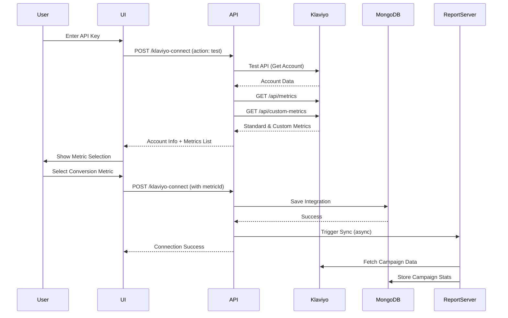

# Klaviyo Connection System Documentation

## Overview
The Klaviyo connection system allows stores to integrate their Klaviyo email marketing platform with the Wizel application. This integration enables campaign analytics, email preview, scheduled campaign visibility, and automated data synchronization.

## Table of Contents
1. [Architecture Overview](#architecture-overview)
2. [Connection Methods](#connection-methods)
3. [API Endpoints](#api-endpoints)
4. [Data Flow](#data-flow)
5. [Store Schema](#store-schema)
6. [Synchronization System](#synchronization-system)
7. [Security & Permissions](#security--permissions)
8. [UI Components](#ui-components)
9. [Testing & Debugging](#testing--debugging)
10. [Common Issues](#common-issues)

## Architecture Overview

### System Components
```
┌─────────────────┐     ┌──────────────────┐     ┌────────────────┐
│   Frontend UI   │────▶│  API Endpoints   │────▶│  Klaviyo API   │
│  (Connect Page) │     │   (Next.js)      │     │   (External)   │
└─────────────────┘     └──────────────────┘     └────────────────┘
                               │
                               ▼
                        ┌──────────────────┐
                        │    MongoDB       │
                        │  (Store Model)   │
                        └──────────────────┘
                               │
                               ▼
                        ┌──────────────────┐
                        │  Report Server   │
                        │  (Python Sync)   │
                        └──────────────────┘
```

### Key Files
- **Frontend**: `/app/(dashboard)/store/[storePublicId]/klaviyo-connect/page.jsx`
- **API Route**: `/app/api/store/[storePublicId]/klaviyo-connect/route.js`
- **Store Model**: `/models/Store.js`
- **Klaviyo Sync Model**: `/models/KlaviyoSync.js`
- **API Client**: `/lib/klaviyo-api.js`
- **Helper Functions**: `/lib/klaviyo-helpers.js`

## Connection Methods

### 1. API Key Connection (Primary Method)
Users provide their Klaviyo Private API Key (starts with `pk_`) directly.

**Pros:**
- Simple implementation
- Immediate connection
- No OAuth setup required

**Cons:**
- User must handle sensitive API key
- Subject to rate limits (10 req/sec burst, 150 req/min sustained)

### 2. OAuth Connection (Future Enhancement)
Redirects users to Klaviyo for authorization.

**Pros:**
- More secure (no API key handling)
- No rate limit restrictions for OAuth apps
- Better user experience

**Cons:**
- Requires OAuth app setup in Klaviyo
- More complex implementation
- Needs callback URL handling

## API Endpoints

### GET `/api/store/[storePublicId]/klaviyo-connect`
Retrieves current Klaviyo integration status.

**Response:**
```json
{
  "success": true,
  "klaviyo_integration": {
    "status": "connected",
    "public_id": "Pe5Xw6",
    "connected_at": "2024-01-15T10:30:00Z",
    "last_sync": "2024-01-15T10:30:00Z",
    "sync_status": "completed"
  }
}
```

### POST `/api/store/[storePublicId]/klaviyo-connect`
Connects or updates Klaviyo integration. Supports two modes: test and connect.

#### Mode 1: Test API Key and Fetch Metrics
**Request Body:**
```json
{
  "apiKey": "pk_xxxxxxxxxxxxxxxxxxxxxxxxxxxxxxxx",
  "action": "test"
}
```

**Response:**
```json
{
  "success": true,
  "action": "test",
  "account": {
    "id": "abc123",
    "name": "Your Company Name"
  },
  "metrics": [
    {
      "id": "metric_123",
      "name": "Placed Order",
      "integration": "Shopify",
      "category": "STANDARD",
      "isShopifyPlacedOrder": true
    },
    {
      "id": "metric_456",
      "name": "Custom Purchase Event",
      "integration": "Custom",
      "category": "CUSTOM",
      "isShopifyPlacedOrder": false
    }
  ]
}
```

#### Mode 2: Complete Connection with Selected Metric
**Request Body:**
```json
{
  "apiKey": "pk_xxxxxxxxxxxxxxxxxxxxxxxxxxxxxxxx",
  "conversionMetricId": "metric_123"
}
```

**Connection Process:**
1. **Step 1: Validate & Fetch Metrics**
   - Validate API key format (must start with `pk_`)
   - Test API connection by fetching account info
   - Fetch account information from `/api/accounts`
   - Fetch standard metrics from `/api/metrics` endpoint
   - Fetch custom metrics from `/api/custom-metrics` endpoint (separate API call)
   - Combine both metric lists, avoiding duplicates
   - Sort metrics with Shopify "Placed Order" first, then alphabetically
   - Return complete metrics list to user for selection

2. **Step 2: Complete Connection**
   - User selects conversion metric
   - System checks if selected metric is Shopify "Placed Order"
   - Save integration details with selected metric
   - Trigger initial sync with report server
   - Include `do_not_order_sync` flag based on metric selection

**Response:**
```json
{
  "success": true,
  "message": "Klaviyo connected successfully",
  "store": {
    "klaviyo_integration": {
      "status": "connected",
      "public_id": "Pe5Xw6",
      "account": { /* Klaviyo account details */ },
      "conversion_metric_id": "metric_123",
      "apiKey": "pk_xxx..."
    }
  }
}
```

### DELETE `/api/store/[storePublicId]/klaviyo-connect`
Disconnects Klaviyo integration.

**Process:**
1. Validate user permissions
2. Reset integration to `not_configured` state
3. Clear all Klaviyo-related data
4. Preserve store data

## Data Flow

### Connection Flow


### Data Synchronization
1. **Initial Connection** - Full sync of all historical data
2. **Incremental Syncs** - Regular updates (every 24 hours)
3. **On-Demand Sync** - User-triggered refresh

## Store Schema

### Klaviyo Integration Object
```javascript
klaviyo_integration: {
  // Connection Status
  status: "connected" | "disconnected" | "error" | "not_configured",
  
  // Klaviyo Account Info
  public_id: "Pe5Xw6",              // Klaviyo Account ID
  account: { /* Full account object from Klaviyo */ },
  
  // API Configuration
  apiKey: "pk_xxx...",              // Private API key (encrypted in production)
  
  // Conversion Tracking
  conversion_type: "value",         // Type of conversion tracking
  conversion_metric_id: "abc123",   // "Placed Order" metric ID
  
  // Timestamps
  connected_at: Date,               // When integration was connected
  last_sync: Date,                  // Last successful sync
  
  // Sync Status Flags
  is_updating_dashboard: false,     // Currently syncing
  campaign_values_last_update: Date,
  segment_series_last_update: Date,
  flow_series_last_update: Date,
  form_series_last_update: Date
}
```

## Synchronization System

### KlaviyoSync Model
Manages incremental synchronization of Klaviyo data.

**Key Methods:**
- `findOrCreateByKlaviyoId()` - Get or create sync record
- `startSync()` - Begin sync operation
- `completeSync()` - Mark sync as complete
- `needsSync()` - Check if sync is needed
- `getSyncDateRanges()` - Get date ranges for incremental sync

### Sync Types
1. **Campaigns** - Email campaign performance (24hr refresh)
2. **Segments** - Customer segments (24hr refresh)
3. **Flows** - Automation flows (48hr refresh)
4. **Forms** - Signup forms (48hr refresh)

### Report Server Integration
The Python report server handles heavy data processing:

**Endpoint:** `POST /api/v1/reports/full_sync`

#### Payload when using Shopify "Placed Order" metric:
```json
{
  "klaviyo_public_id": "Pe5Xw6",
  "store_public_id": "rTSYCj7",
  "do_not_order_sync": false
}
```

#### Payload when using any other metric (custom or non-Shopify):
```json
{
  "klaviyo_public_id": "Pe5Xw6",
  "store_public_id": "rTSYCj7",
  "do_not_order_sync": true
}
```

**Field Explanations:**
- `klaviyo_public_id`: The Klaviyo account ID
- `store_public_id`: The store's public ID in our system
- `do_not_order_sync`: Boolean flag
  - `false` - When using Shopify "Placed Order" metric (sync order data)
  - `true` - When using any other metric (skip order sync)

**Process:**
1. Fetch campaign statistics from Klaviyo
2. Process and aggregate metrics
3. Store in MongoDB `campaignstats` collection
4. Update sync status
5. If `do_not_order_sync` is false, also sync order/revenue data

## Security & Permissions

### Permission Requirements
Users must have `manage_integrations` permission to:
- Connect Klaviyo
- Disconnect Klaviyo
- Update API keys

### Permission Check Flow
```javascript
async function validatePermissions(userId, storeId) {
  // 1. Find user's contract seat
  const contractSeat = await ContractSeat.findOne({
    user_id: userId,
    'store_access.store_id': storeId
  });
  
  // 2. Get role for this store
  const role = await Role.findById(storeAccess.role_id);
  
  // 3. Check permissions
  const hasPermission = role.permissions?.stores?.manage_integrations;
  
  // 4. Verify role level (owner=100, admin=80)
  return hasPermission && role.level >= 80;
}
```

### API Key Security
- **Storage**: API keys should be encrypted in production
- **Transmission**: Always use HTTPS
- **Validation**: Keys must start with `pk_` for private keys
- **Access**: Never expose keys to frontend beyond initial entry

## UI Components

### Connect Page (`/klaviyo-connect/page.jsx`)

**Features:**
1. **Connection Status Display** - Shows if connected/disconnected
2. **Two Connection Methods** - OAuth and API Key options
3. **API Key Validation** - Real-time validation of key format
4. **Help Section** - Instructions for finding API key
5. **Disconnect Option** - When already connected

**State Management:**
```javascript
const [store, setStore] = useState(null);
const [loading, setLoading] = useState(true);
const [connecting, setConnecting] = useState(false);
const [klaviyoApiKey, setKlaviyoApiKey] = useState("");
```

**Key Validations:**
- API key must start with `pk_`
- Required fields validation
- Connection state checks

## Testing & Debugging

### Test Endpoint
`GET /api/klaviyo/test?apiKey=pk_xxx`

Tests API connection and returns:
- Lists count and samples
- Available metrics
- Rate limit status
- API revision

### Debug Checklist
1. **Check API Key Format** - Must start with `pk_`
2. **Verify Permissions** - User needs manage_integrations
3. **Check Rate Limits** - 10/sec burst, 150/min sustained
4. **Validate Account** - Ensure Klaviyo account is active
5. **Check Metrics** - "Placed Order" metric should exist
6. **Review Logs** - Check server logs for API errors

### Common Log Locations
```javascript
// Connection attempt
console.log('Testing Klaviyo API key:', apiKey.substring(0, 7) + '...');

// Account fetch
console.time("klaviyo fetches");

// Sync trigger
console.log("Triggering report server sync (fire-and-forget)");

// Error states
console.error("Error testing Klaviyo API key:", error);
```

## Common Issues

### 1. API Key Invalid
**Error:** "Failed to validate API key"
**Solution:** 
- Ensure key starts with `pk_`
- Check key hasn't been revoked
- Verify Klaviyo account is active

### 2. Rate Limit Exceeded
**Error:** 429 Too Many Requests
**Solution:**
- Implement exponential backoff
- Use OAuth connection (no rate limits)
- Batch API requests

### 3. Conversion Metric Not Found
**Warning:** No "Placed Order" metric
**Solution:**
- Check if Shopify integration exists
- Manually select conversion metric
- Create custom metric in Klaviyo

### 4. Sync Not Starting
**Issue:** Report server not triggering
**Checks:**
- `REPORT_SERVER` env variable set
- `REPORT_SERVER_KEY` configured
- Network connectivity to report server
- Check report server logs

### 5. Permission Denied
**Error:** "Insufficient permissions"
**Solution:**
- User needs owner or admin role
- Check ContractSeat configuration
- Verify role has manage_integrations permission

## Environment Variables

Required environment variables for Klaviyo integration:

```env
# Klaviyo API Configuration
KLAVIYO_REVISION=2025-07-15

# OAuth Configuration (if using OAuth)
NEXT_PUBLIC_KLAVIYO_CLIENT_ID=your_client_id
NEXT_PUBLIC_APP_URL=https://yourapp.com
KLAVIYO_CLIENT_SECRET=your_client_secret

# Report Server Configuration
REPORT_SERVER=http://localhost:8001
REPORT_SERVER_KEY=your_report_server_key
```

## Conversion Metric Logic

### Metric Selection Impact
The selected conversion metric determines how the report server processes data:

1. **Shopify "Placed Order" Metric**
   - Identified by: `name === "Placed Order" && integration.key === "shopify"`
   - Report server payload: `do_not_order_sync: false`
   - Behavior: Full order and revenue data synchronization
   - Use case: Shopify stores tracking e-commerce conversions

2. **Custom or Other Metrics**
   - Any metric that is NOT Shopify "Placed Order"
   - Report server payload: `do_not_order_sync: true`
   - Behavior: Skip order-specific synchronization
   - Use cases:
     - Custom conversion events (sign-ups, downloads, etc.)
     - Non-Shopify e-commerce platforms
     - Lead generation tracking
     - Custom business metrics

### Example Decision Flow
```javascript
// Determine if using Shopify Placed Order
const isShopifyPlacedOrder = 
  selectedMetric.attributes.name === "Placed Order" && 
  selectedMetric.attributes.integration?.key === "shopify";

// Set sync flag accordingly
const syncPayload = {
  klaviyo_public_id: "Pe5Xw6",
  store_public_id: "rTSYCj7",
  do_not_order_sync: !isShopifyPlacedOrder
};
```

## Best Practices

1. **Always validate API keys** before making API calls
2. **Use fire-and-forget pattern** for report server sync
3. **Handle rate limits gracefully** with exponential backoff
4. **Encrypt API keys** in production database
5. **Log important operations** for debugging
6. **Check permissions** before any modification
7. **Provide clear error messages** to users
8. **Test connection** before saving to database
9. **Clean up on disconnect** - reset all integration fields
10. **Monitor sync status** - implement health checks

## Future Enhancements

1. **OAuth Implementation** - Complete OAuth flow for better security
2. **Webhook Support** - Real-time updates via Klaviyo webhooks
3. **Selective Sync** - Choose which data types to sync
4. **Sync Scheduling** - Custom sync intervals
5. **Multi-Account Support** - Connect multiple Klaviyo accounts
6. **Metric Selection UI** - Let users choose conversion metric
7. **Sync Progress UI** - Show real-time sync progress
8. **Error Recovery** - Automatic retry on failures
9. **Audit Logging** - Track all connection changes
10. **API Key Rotation** - Support key rotation without disconnect